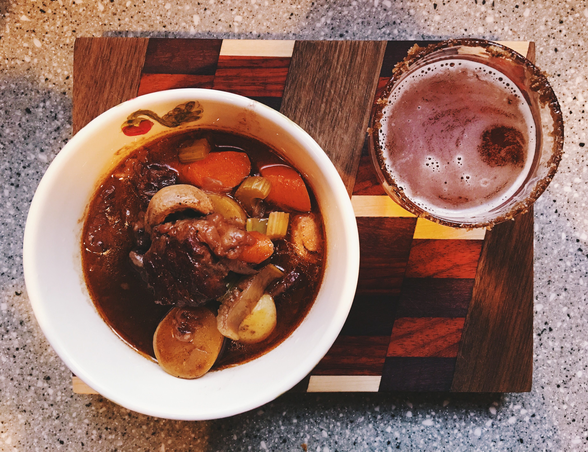

# Beef Stew

It is rare that something I cook moves me in a way that requires me to put pixels to screen and write a post about it. You may remember, last time, being subjected to a story about a fateful night where, after a decade of trying, I was able to reproduce a **beef bulgogi** dish that flooded my brain with memories of friends and colleagues. Today you will hear about the wonderfully nostalgic beef stew I made that reminded me of some of the most favorite winter days of my youth.

The idea for this dinner started after my mother received a wonderful gift from a longtime friend, a Staub 3.5qt Pumpkin Cocotte. The build of this pot is nothing short of beautiful. Everything from the pumpkin shape to the bright orange hues and the gorgeous brass handle was calling out for me to create a delicious fall dish in it; and the only meal that came to mind was a steaming bowl of beef stew—never mind that it was a humid 95º out.

I will start by saying, I very rarely cook beef stew; Anna is not a huge fan of stews so we opt to cook other wintertime meals, like soups; I will end by stating, I absolutely **love** beef stew.

When I eat a good beef stew I am immediately transported to my teenage self, sitting at the dinner table with my mother and father. It is a wonderful memory of talking and laughing, spending meaningful time together, and doing what I love the most, eating. At this time of the year these memories always creep into my brain. This year even more so as in a few days it will be fifteen years without my wonderful father.

He was a man who loved to cook. He would read newspapers every day and would have loads of recipe clippings from them. There are still a number of recipes he had that I would love to know, especially his barbecued mint chicken, but alas, they are lost! He would stand at the stove, morning, noon, or night, cooking and singing some of the most ridiculous songs—many of which I can not repeat here. It would seem when we were at our house in the Catskills the songs would become even sillier.

If I were being true to my father’s stewing capabilities this recipe would be one filled with olives and fresh rabbit or squirrel; but the beef stew I loved the most was one that my mother would make. It was filled with the most tender and flavorful beef, loads of vegetables, and tons of wide egg noodles. She may not sing and dance like dad did at the stove, but her meals were equally memorable. I can thank her for my midnight cravings for bacon dip and toast with peanut butter, cinnamon, and sugar.

Maybe my brain chose this meal subconsciously or maybe two years without eating stew is two years too many. In any case I never had a great recipe, but do now. I always worked with four separate recipes and merged as needed. Sometimes it would come out good, sometimes meh. I would try different things like using wine instead of water or beef stock, using noodles, using various types of vegetables, and using different spices. This time I started with my base stew recipe that came from Paula Deen and merged it with an Ina Garten recipe and a Tyler Florence recipe.

My mom and I were **very** happy with the outcome, I was literally licking the bowl clean when I was done.

# Beef Stew
## Ingredients
* 2 lbs of stew beef (chuck, chuck eye, chuck roast, etc.), cut into 2” cubes
* 1 c flour
* 3 tbsp olive oil
* 2 c good red wine (cabernet sauvignon)
* 1 to 2 c beef stock (or more wine)
* 2 tbsp Worcestershire Sauce
* 2 cloves garlic, minced
* 2 bay leaves
* 1 medium onion, sliced
* 1 tsp salt
* 1 tsp sugar
* ½ tsp pepper
* ½ tsp paprika
* ½ tsp ground allspice
* 3 large carrots, sliced
* 3 ribs celery, sliced
* 9 small Yukon Gold potatoes
* ½ lb white mushrooms

## Directions
It is important to use good stew beef, for my recipe I used a few nice chuck eye steaks and cut them into 2” cubes. For the wine I found Cannonball’s 2012 cabernet sauvignon to be absolutely delicious in this recipe.

It is important to use a good heavy pot, the Staub mentioned above is an enameled cast iron pot; had I not used it, I would have used my trusty Le Creuset French Oven.

Preheat the oil in the pot.

Place the flour in a large bowl, season the beef with salt and pepper, and toss the beef in the flour to coat. Shake off any excess flour and brown in the hot pot. Do not crowd the pot, place just enough to create a single layer. If after a batch you do not have enough oil, add a bit more. When the beef is browned remove it to a plate for later use.

Add the wine to the pot and bring to a simmer. While the wine is heating, scrape all of the brown bits off the bottom of the pot. Once simmering, add the beef to the wine along with the Worcestershire sauce, garlic, bay leaves, onion, salt, sugar, pepper, paprika, and allspice. If the beef is above the wine add a bit of beef stock—or more wine—until it is mostly submerged in liquid. 

Cover and simmer for 1 1/2 hours. Remove the bay leaves and add the carrots, mushrooms, potato, and celery. Cover and cook until the vegetables are fork tender, about 30 to 40 minutes longer.

Enjoy a hot bowl of memories.

#recipes #dinner #@writing