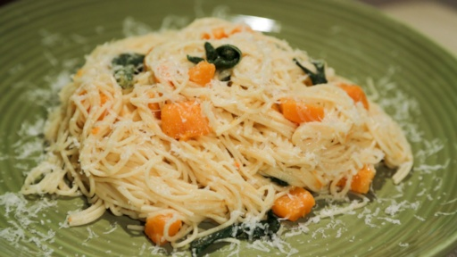

# Brown Butter Squash and Sage Pasta

## Ingredients
* 1½ pounds Angel Hair Pasta
* 2 cups Butternut Squash (½” dice)
* 3 tablespoons Extra-Virgin Olive Oil
* 4 tablespoons Butter
* 6 Sage leaves plus more to garnish
* ½ cup Parmigiano Reggiano (grated)
* Salt and Pepper to taste

## Directions
Bring large pot of salted water to a boil.

In a large skillet, heat olive oil until smoking. Add squash and season with salt and pepper. Saute for 7-8 minutes or until squash is tender.

Add butter and sage to pan and continue to saute to brown butter and infuse sage flavor, about 2 minutes.

Meanwhile, add angel hair pasta to boiling water. Stir occasionally until pasta is cooked, about 3 minutes.

Remove pasta from water and transfer directly to large skillet. Add parmigiano reggiano and toss to combine. Loosen with starchy pasta water if needed.

Garnish with fresh sage leave and serve.

#recipes #dinner