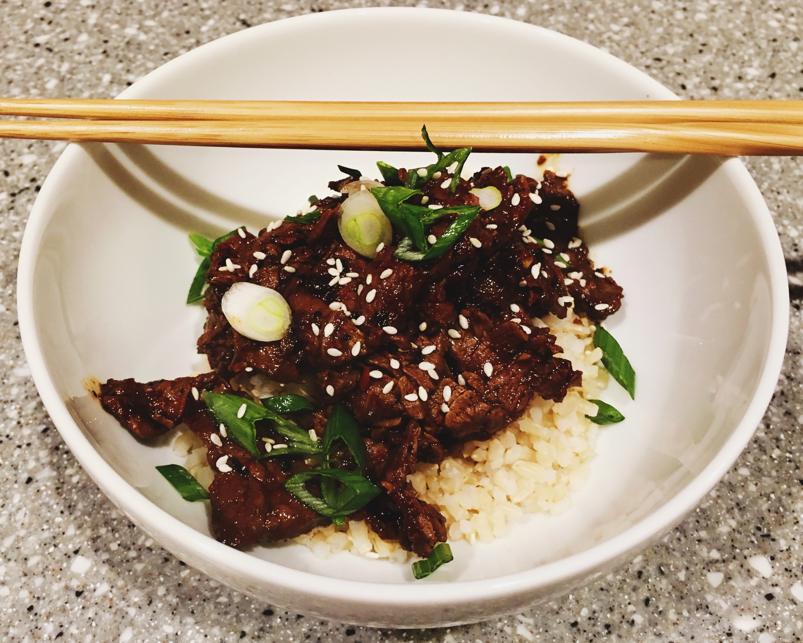

# Bulgogi

Last night, while perusing Bon Appétit Magazine, I discovered the base for a truly great beef bulgogi. It was the first time I had tried the recipe, and the instant I tasted it, I knew it was what I had spent more than a decade looking for. I have made some changes to their recipe to reflect the things I love most about both beef and pork bulgogi.

First, some history: beef bulgogi is an incredibly nostalgic meal for me. I first ate it back in 2003 while Deepend had it’s offices between 11th and 12th on Broadway in Manhattan. We were working out of an apartment and had a full kitchen and outdoor deck where we would cook and BBQ lunch and dinner.

My buddies Ben, Iti, and I would regularly go over to M2M mart, a Japanese market, to buy pre-marinated beef and pork bulgogi. Ben and Iti’s cooking skills were far above mine and the experience I received helping them was invaluable. If not for their influence in my early culinary excursions, I would not have a love for cooking and food to the degree that I have. Some of my favorite meals and recipes are thanks to them, including galbijjim, bulgogi, chimichurri, and tikka masala.

For years I was unable to emulate M2M’s spicy pork bulgogi recipe. The spicy flavor that had eluded me for so long was gochugaru, Korean chili flakes. At the bottom of the recipe I talk about how you can make substitutions to adjust the recipe for pork.

So without further ado, this is my altered recipe of  [Basic Bulgogi](http://www.bonappetit.com/recipe/basic-bulgogi) :

# Beef Bulgogi
_with notes for pork at end_

## Ingredients
* ¼ pear, grated
* 1 garlic clove, grated or finely minced
* 2 tbsp low sodium soy sauce
* 1 tbsp gochugaru
* 1 tbsp grated or finely minced, peeled ginger
* 1 tbsp light brown sugar
* ½ to 1 tbsp mirin (optional)
* 1 tbsp toasted sesame oil
* 1 lb skirt, flank, or hanger steak
* vegetable oil
* salt (optional)
* scallions (optional)
* sesame seeds (optional)

* **I would like to try adding Sambal Oelek to this**
* **I would like to see the difference between gochugaru and gochujang**

## Directions
Note on grating vs finely mincing garlic and ginger: when cooking bulgogi and galbijjim I prefer grating as the flavors become more readily incorporated into the marinade. If you are feeling lazy and do not want to grate, finely mincing the garlic and ginger will not alter the taste too drastically, especially if you are marinating the meat for a longer period of time. If you are only marinading the meat for a half hour, grating will allow those flavors to penetrate quicker.

Slice steak into very thin slices. I prefer using skirt steak. I usually cut the skirt steak into more manageable 3” to 4” medallions, then slice as thin as I can against the grain at a 45° angle to the cutting board. If you have a hard time slicing the meat you can freeze the meat for, at most, 2 hours; this will make the meat easier to cut. Slicing the steak correctly is the key to this recipe, if it is not cut thin and against the grain you may end up with tough meat. I will have to create a post on how to cut skirt steak, but for now here is a video from Serious Eats:  [How to Cut Beef for Stir Fries](http://www.seriouseats.com/2010/11/knife-skills-how-to-cut-beef-for-stir-fries.html) .

Place pear, garlic, soy sauce, gochugaru, ginger, brown sugar, sesame oil, mirin (optional) and sliced meat in a large zip lock bag and mix well.

Marinate for at least 30 minutes out of refrigerator or up to 8 hours in the refrigerator. The meat is cut thin so it will not take long for the marinade to penetrate.

If refrigerated, take the meat out 30 minutes early to allow it to come to room temperature.

Season meat with salt, remember it’s been marinated in soy sauce so you don’t need much here. If you didn’t use low sodium soy sauce you may not want to add salt.

Heat a cast iron skillet over medium-high to high heat, which ever you are comfortable with. I had my stove on medium power boil which is above high. Working in batches—for a pound you can do it in two batches, above a pound you may need three or more—place up to a tablespoon of oil in the pan then the meat. Cook on high, turning, till the edges of the meat start to darken and become crispy.

A few warnings here, the gochugaru may make you cough when it is cooking so make sure you use your overhead vent or open a window; also, between the oil and the fat from the meat, there will be a lot of splatter, do not wear something you love, and use a splatter screen if you have one.

Serve on rice, I prefer a short grain brown or a Japanese sushi rice; top with scallion and sesame seeds.

## Notes
First, the beef bulgogi I ate at M2M was a tad sweeter than the Bon Appétit recipe and less spicy. If you wanted a slightly sweeter bulgogi then you should use the optional mirin—or if you have no mirin, substitute with more brown sugar—and potentially reduce the amount of gochugaru by a half to full tbsp. If you do neither of these it will still be amazingly delicious.

Second, the pork bulgogi from M2M was some of the best bulgogi I ever ate. As mentioned above I could never figure out what it was that I was tasting until I tried Bon Appétit’s recipe with the gochugaru. The gochugaru is key, Bon Appétit’s recipe suggests you can substitute it with regular red pepper flakes, I can not stress this enough, **you can not**. If you are going to make the spicy pork bulgogi I suggest substituting the beef for boneless pork loin, adding a bit more gochugaru than I specified—by a half or full tbsp, and skip the mirin.

Finally, I prefer using ingredients that correspond to the nationality the food originates from. It’s entirely possible to ditch the brown sugar altogether and substitute it for mirin. Also, many people don’t like using low-sodium soy sauce because of the extra chemicals, you could substitute it for regular soy sauce; if you do, do not add extra salt to the meat.

<a href='Knife%20Skills%20How%20to%20Cut%20Beef%20For%20Stir%20Fries%20|%20Serious%20Eats.60dfb07a1483483886d65e1f361e8743.pdf'>Knife%20Skills%20How%20to%20Cut%20Beef%20For%20Stir%20Fries%20|%20Serious%20Eats.60dfb07a1483483886d65e1f361e8743.pdf</a>
<a href='Bulgogi%20Recipe%20-%20Bon%20Appétit.pdf'>Bulgogi%20Recipe%20-%20Bon%20Appétit.pdf</a>

#recipes #dinner #@writing