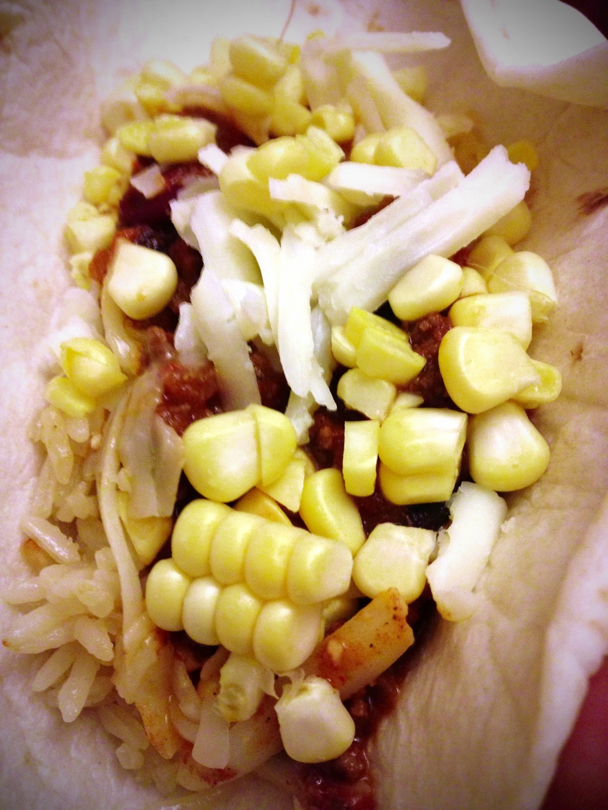

# Chili
_Yields 6 to 8 services._

## Ingredients
* 1 tbsp bacon fat or vegetable oil
* 1¼ to 1½ lbs ground beef
* 1 large onion, chopped
* 1 large orange bell pepper, chopped
* 2 tbsp ground cumin
* 1 tbsp minced garlic
* 1 tbsp chili powder
* 1 tbsp Hot Mexican chili powder (or another tbsp regular chili powder)
* 1 tbsp Essence or cajun spices
* 1 tbsp paprika
* ½ tsp salt, plus salt to season the meat
* 1 tsp dried Mexican oregano
* 1 28oz can crushed tomatoes
* 1 can red kidney bean, drained
* 1 can black bean, drained
* 1 tbsp brown sugar (or 1 tbsp regular sugar & 1 tsp molasses)
* 3 tbsp tomato paste
* Chicken or Beef Stock or Beer

## Optional Toppings
* Shaved Fresh Corn
* Raw Onion
* Cheddar

## Directions
Heat the oil in a large, heavy pot over medium-high heat.

Season the meat with salt. Add the meat and stir with a long-handled wooden spoon to break up the pieces.

Cook, stirring, until the meat is brown and cooked through, about 5 minutes.

Add the onion, orange bell pepper, garlic, chili powder, Essence, paprika, salt, cumin, oregano, drained kidney beans, drained black beans and cook, stirring, until soft, about 4 minutes.

Add the crushed tomatoes and their juices, the tomato paste, and sugar (and molasses). Add chicken stock to the pot, you’re really looking for consistency here, add as much as you’d like till the consistency is the way you’d like it. As you boil, some of the stock will boil off so you may want to add a little more. Stir well and bring to a boil. Lower the heat to medium-low and simmer, uncovered, for 30 minutes to 2 hours (the longer the better but 30 mins will be just fine), stirring occasionally to prevent the chili from sticking to the bottom of the pot. Remove the pot from the heat.

#recipes #dinner