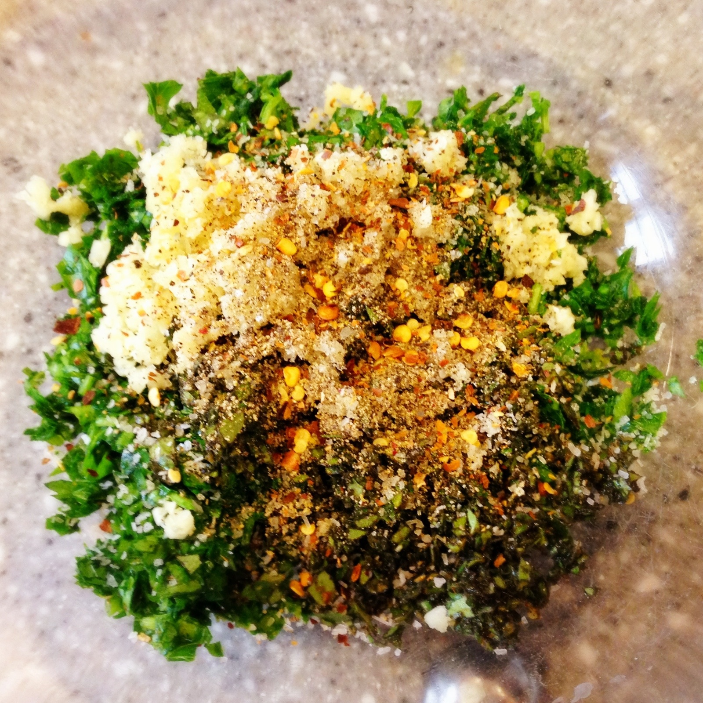

# Chimichurri

## Ingredients
* 1 cup firmly packed fresh flat-leaf parsley, trimmed of thick stems
* 3-4 garlic cloves
* 2 Tbsps fresh oregano leaves (can sub 2 teaspoons dried oregano)
* ½ cup olive oil
* 2 Tbsp red or white wine vinegar
* 1 teaspoon sea salt
* ¼ teaspoon freshly ground black pepper
* ¼ teaspoon red pepper flakes

## Directions
Finely chop the parsley, fresh oregano, and garlic (or process in a food processor several pulses). Place in a small bowl.

Stir in the olive oil, vinegar, salt, pepper, and red pepper flakes. Adjust seasonings.

Serve immediately or refrigerate. If chilled, return to room temperature before serving. Can keep for a day or two.

#recipes #sides