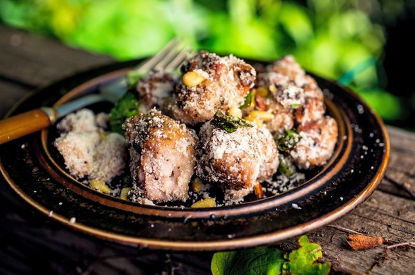

# Grilled Chicken Skewers With Deconstructed Pesto

## Ingredients
* 3  pounds of boneless, skinless chicken thighs, cut into 1-inch chunks
* ¼  cup plus ⅓ cup extra-virgin olive oil
* Salt and pepper to taste
* 1  cup grated Parmesan (about 2 ounces)
* 1  cup roughly chopped fresh basil
* ⅓  cup toasted pine nuts
* 4  teaspoons minced garlic

## Directions
Build a fire in your grill; when the flames have died down, all the coals are covered with gray ash and the temperature is medium (you can hold your hand 5 inches above the grill for about 5 seconds), you’re ready to cook. (For a gas grill, turn all burners to high, lower cover and heat for 15 minutes, then turn burners to medium.)

Combine the chicken, 3 tablespoons of olive oil and the salt and pepper in a large bowl and toss well to coat, then thread the chicken chunks onto the skewers so they press up against one another but aren’t jammed together.

Put the skewers on the grill directly over the coals and cook, rolling the skewers around every 3 to 4 minutes to ensure all the sides are more or less evenly exposed to the heat, until lightly seared, about 12 to 14 minutes. To check for doneness, make a small cut and peek inside a couple of the chunks to be sure they are opaque all the way through with no pink.

Slide the chicken chunks off the skewers into a large bowl, add all the other ingredients one after the other, toss well to coat evenly, season to taste if needed and serve.

#recipes #dinner