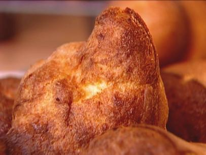

# Popovers

## Ingredients
* 1½ tablespoons unsalted butter, melted, plus softened butter for greasing pans
* 1½ cups flour
* ¾ teaspoon kosher salt
* 3 extra-large eggs, at room temperature
* 1½ cups milk, at room temperature

## Directions
Preheat the oven to 425 degrees F.

Generously grease aluminum popover pans or Pyrex custard cups with softened butter. You’ll need enough pans to make 12 popovers. Place the pans in the oven for exactly 2 minutes to preheat.

Meanwhile, whisk together the flour, salt, eggs, milk, and melted butter until smooth. The batter will be thin. Fill the popover pans less than half full and bake for exactly 30 minutes. Do not peek.

#recipes #sides #breakfast