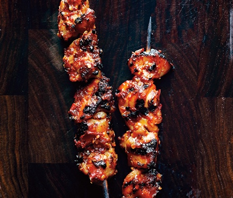

# Sambal Chicken Skewers Recipe

## Ingredients
* ½ cup (packed) light brown sugar
* ½ cup unseasoned rice vinegar
* ⅓ cup hot chili paste (such as sambal oelek)
* ¼ cup fish sauce (such as nam pla or nuoc nam)
* ¼ cup Sriracha
* 2 teaspoons finely grated peeled ginger
* 1½ pounds skinless, boneless chicken thighs, cut into 1½”-2” pieces
* Ingredient info: Hot chili paste is available at Asian markets and many supermarkets.
* Special equipment: 8 bamboo skewers soaked in water at least 1 hour

## Directions
Prepare grill for medium-high heat. Whisk brown sugar, vinegar, chili paste, fish sauce, Sriracha, and ginger in a large bowl. Add chicken and toss to coat. Thread 4 or 5 chicken pieces onto each skewer.

Transfer marinade to a small saucepan. Bring to a boil, reduce heat, and simmer until reduced by half (about 1 cup), 7-10 minutes.

Grill chicken, turning and basting often with reduced marinade, until cooked through, 8-10 minutes.

#recipes #dinner