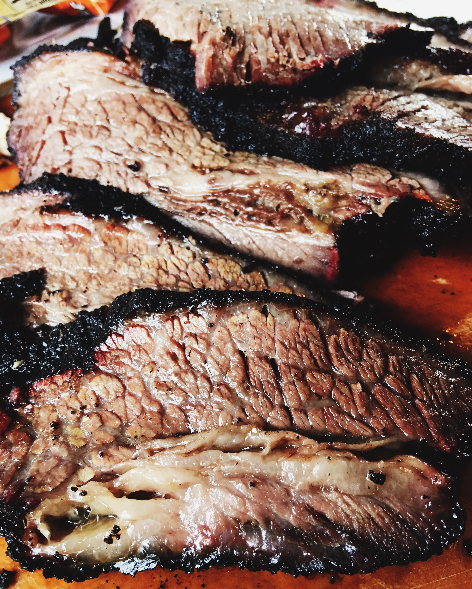

# Smoked Brisket

 [amazingribs.com](http://amazingribs.com/recipes/beef/texas_brisket.html) 
 [amazingribs.com](http://amazingribs.com/tips_and_technique/weber_smokey_mountain_setup.html) 

## Ingredients
* 8 lb Brisket, fat cap trimmed to ¼”
* ¼ c Salt
* ¼ c Pepper
* 8 oz Beef broth (1oz per lb)
* 3 to 4 Chunks Hickory or 12 to 16 oz chips (3 or 4 x 4oz)

## Directions
The night before smoking, inject all beef broth into the brisket; dampen lightly with water; rub salt & pepper all over brisket; let sit in refrigerator overnight.

On the morning of cooking preheat the smoker to 235º; throughout the cooking process keep it between 225º and 275º.

Place brisket in smoker and cook for 8 to 12 hours, until the meat has an internal temperature of 190º to 203º.

If you are cooking beans with the brisket, you can place the brisket fat side down so it drips into the beans, YUM! You can flip the brisket three hours into cooking if you would like.

If the brisket stalls at 150º to 160º you can crutch it by wrapping the brisket very tightly in aluminum foil when it hits this temperature. You can place a ¼ cup of beef broth in with the brisket in the foil. This will cause the cooking time to decrease and help get through the temperature stall. If you do this the brisket will not have a crunchy bark; ensure you have enough time at the end to cook it over direct flames for ten minutes on each side to crisp up the softened brisket.

Once the temperature has hit the desired doneness you should tightly wrap in foil and place within a cooler or an over set to 170º to rest for 1 to 4 hours.

Slice brisket against the grain.

<a href='Barbecue%20Brisket%20Recipe%20Texas%20Style,%20A%20Detailed%20Step%20By%20Step%20Guide.pdf'>Barbecue%20Brisket%20Recipe%20Texas%20Style,%20A%20Detailed%20Step%20By%20Step%20Guide.pdf</a>
<a href='The%20Best%20Setup%20For%20A%20Weber%20Smokey%20Mountain%20Barbecue%20Smoker%20And%20Other%20Bullet%20Shaped%20Charcoal%20Smokers.pdf'>The%20Best%20Setup%20For%20A%20Weber%20Smokey%20Mountain%20Barbecue%20Smoker%20And%20Other%20Bullet%20Shaped%20Charcoal%20Smokers.pdf</a>

#recipes #dinner