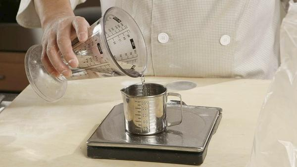
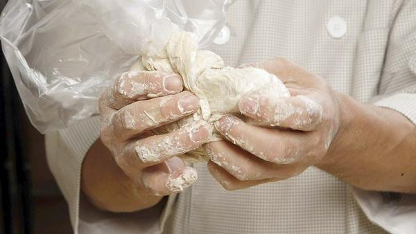
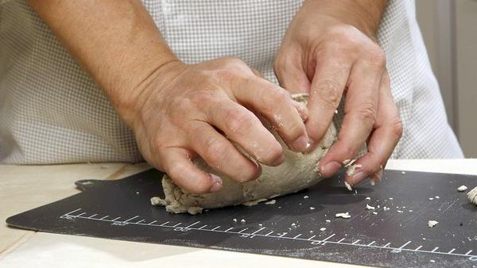
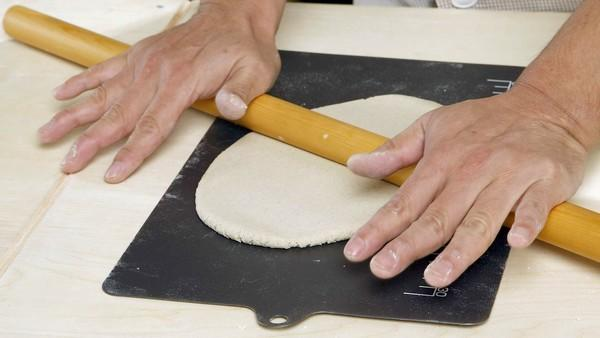
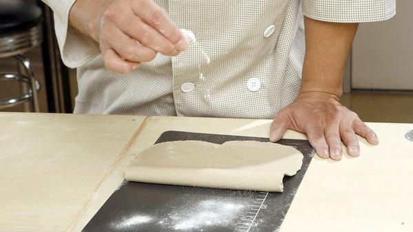
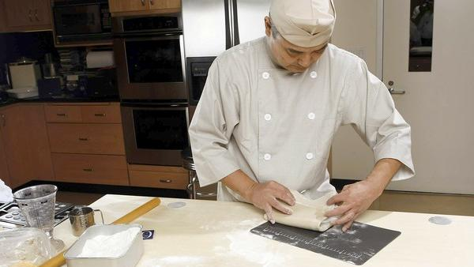
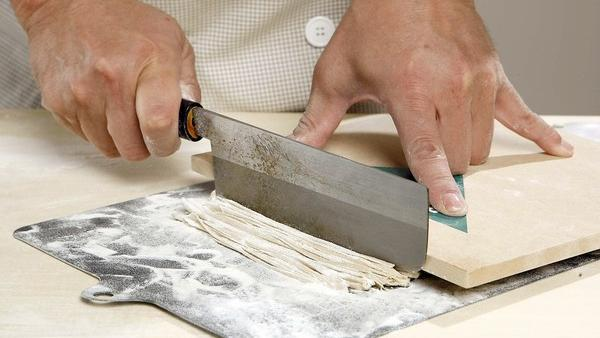

# Soba Noodles
_Total time: 25 minutes_
_Servings: 2_

## Ingredients
* 160 grams stone-milled buckwheat flour for soba (Cold Mountain buckwheat flour)
* 40 grams all-purpose flour
* 80 grams cold water
* Cornstarch for dusting

## Directions
Place the buckwheat and all-purpose flours in a gallon-size resealable plastic bag, along with the cold water. Seal the bag closed and work the water into the flours, massaging the mixture with both hands, until well combined. Continue to work the dough until it forms a single mass. (Press and rub the sides of the bag against the dough to pick up as much as you can of any dough that’s sticking to the bag.)

Remove the dough from the bag to a cutting board. Working quickly and using the heels of your hands, continue to knead firmly until a smooth dough forms. (If the dough feels dry, lightly wet the tips of your fingers with more cold water, brushing them against the surface of the dough and continue kneading until smooth). The final dough will be soft, smooth and not sticky. This will take about 4 to 5 minutes. Form the dough into a smooth ball.

Cover the dough loosely with plastic wrap while you sprinkle cornstarch on a large cutting board. Place the ball on the board and lightly sprinkle cornstarch over the top. Using your palm and the heel of your hand, flatten the ball into a disk about one-half inch thick.

Use a rolling pin to roll the disk into a rectangle (about 20 by 12 inches) one-eighteenth-inch thick. Generously sprinkle cornstarch over half of the dough and fold the other half of the dough over, like a book (the cornstarch will keep the dough from sticking together as it is cut). Generously dust another crosswise half of the dough with cornstarch and fold again.

Starting along the short, folded side of the dough, slice it into very thin (about one-sixteenth-inch) noodles. Keep the noodles loosely covered with plastic wrap while you boil the water for cooking.

To cook the noodles: Bring a large pot of water (at least 2 gallons) to a boil over high heat. Gently drop the soba into the boiling water. Keep the water boiling vigorously to prevent the noodles from sticking together. Cook the noodles to al dente, about 90 seconds (timing will vary depending on the thickness of the noodles)

Immediately remove the noodles to a strainer set in a bowl of ice water to stop the cooking. Prepare a second bowl of ice water and transfer to the second bowl to remove any surface starch and cool completely. Drain the noodles.

## Notes
Serve with soba-tsuyu dipping sauce or walnut dipping sauce (see accompanying recipes) on the side, along with condiments.

Serve the noodles with dipping sauce and condiments such as sliced green onions, finely grated daikon and shichimi pepper on the side. Reserve some of the cooking liquid (sobayu); this can be used to add to the dipping sauce, in amount desired, for a soup. 

<a href='Making%20soba%20noodles%20the%20easy%20way%20-%20LA%20Times.pdf'>Making%20soba%20noodles%20the%20easy%20way%20-%20LA%20Times.pdf</a>

#recipes #dinner