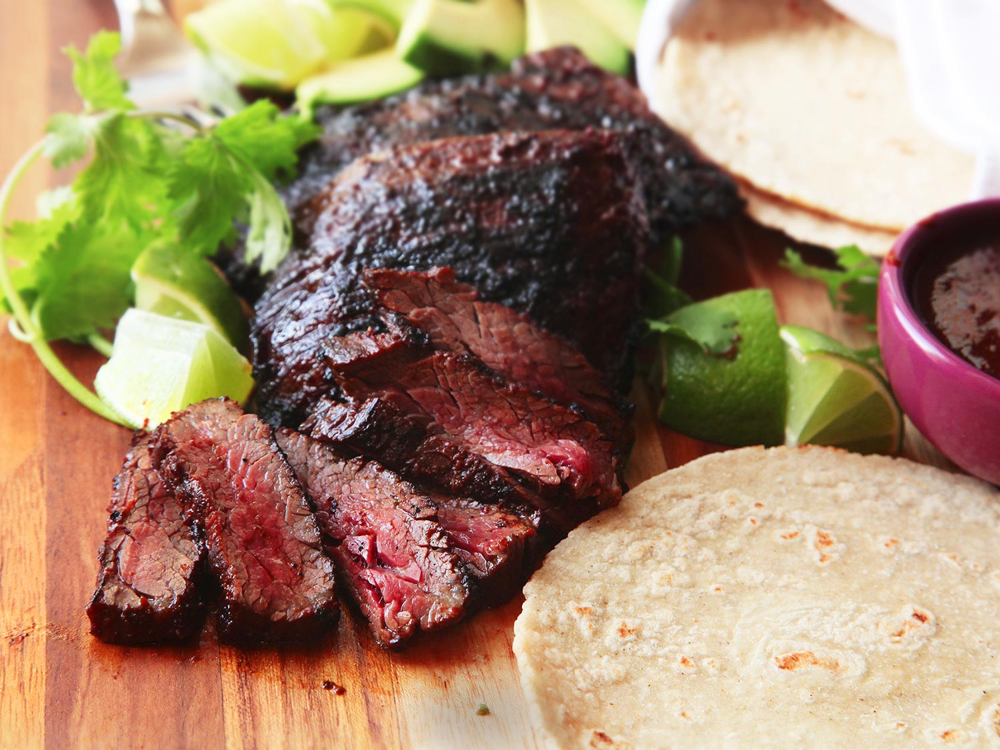

# The Best Carne Asada

## Ingredients
* 3 whole dried ancho chilies, stems and seeds removed (see note above)
* 3 whole dried guajillo chilies, stems and seeds removed (see note above)
* 2 whole chipotle peppers, canned in adobo
* ¾ cup fresh juice from 2 to 3 oranges, preferably sour oranges
* 2 tablespoons fresh juice from 2 to 3 limes
* 2 tablespoons extra-virgin olive oil
* 2 tablespoons soy sauce
* 2 tablespoons Asian fish sauce
* 6 medium cloves garlic
* 1 small bunch cilantro, leaves and tender stems only, divided
* 1 tablespoon whole cumin seed, toasted and ground
* 1 teaspoon whole coriander seed, toasted and ground
* 2 tablespoons dark brown sugar
* Kosher salt
* 2 pounds skirt steak (2 to 3 whole skirt steaks), trimmed and cut with the grain into 5- to 6-inch lengths
* Warm corn or flour tortillas, lime wedges, diced onion, fresh cilantro, and avocado, for serving

## Directions
Place dried ancho and guajillo chilies on a microwave-safe plate and microwave until pliable and toasty-smelling, 10 to 20 seconds. Transfer to the jar of a blender and add chipotle peppers, orange juice, lime juice, olive oil, soy sauce, fish sauce, garlic, cilantro, cumin seed, coriander seed, and brown sugar. Blend until a smooth sauce has formed, about 1 minute. Season to taste with salt. Transfer half of the salsa to a large bowl and the other half to a sealed container. Set aside the sealed container in the refrigerator.

Add an extra 2 teaspoons of salt to the salsa in the bowl. It should taste slightly saltier than is comfortable to taste. Add 1 piece of steak to bowl and turn to coat. Transfer to a gallon-sized zipper-lock bag with the top folded over to prevent excess sauce and meat juices from contaminating the seal. Repeat with remaining steak, adding it all to the same bag. Pour any excess marinade over the steak. Squeeze all air out of the bag and seal. Refrigerate for at least 3 hours and up to overnight.

When ready to cook, remove the extra salsa from the fridge to allow it to warm up a little. Light one chimney full of charcoal. (http:www.seriouseats.com_2009/04_grilling-lighting-the-fire-without-lighter-fluid.html) When all the charcoal is lit and covered with gray ash, pour out and arrange the coals on one side of the charcoal grate. Set cooking grate in place, cover grill, and allow to preheat for 5 minutes. Alternatively, set half the burners on a gas grill to the highest heat setting, cover, and preheat for 10 minutes. [Clean](http://www.seriouseats.com/2010/04/how-to-clean-your-grill-barbecue-oiling-thegrate-charcoal.html#cleaningthegrillgrate) and [oil the grilling grate](http://www.seriouseats.com/2010/04/how-to-clean-your-grill-barbecue-oiling-thegrate-charcoal.html#oilingthegrate).

Remove steak from marinade and wipe off excess. Place directly over the hot side of the grill. If using a gas grill, cover; if using a charcoal grill, leave exposed. Cook, turning occasionally, until steak is well charred on outside and center registers 110°F on an instant-read thermometer, 5 to 10 minutes total. Transfer to a cutting board and allow to rest for 5 minutes. Slice thinly against the grain and serve immediately, passing extra salsa, lime wedges, avocado, onions, cilantro, and tortillas on the side.

<a href='The%20Best%20Carne%20Asada.0cf2c96782b443d1ac9777af72f36f35.pdf'>The%20Best%20Carne%20Asada.0cf2c96782b443d1ac9777af72f36f35.pdf</a>

#recipes #dinner