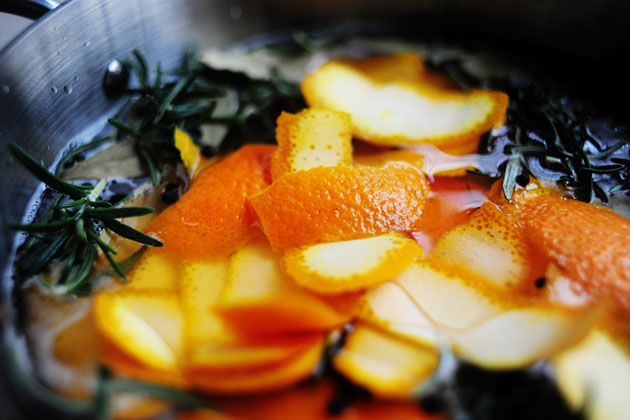
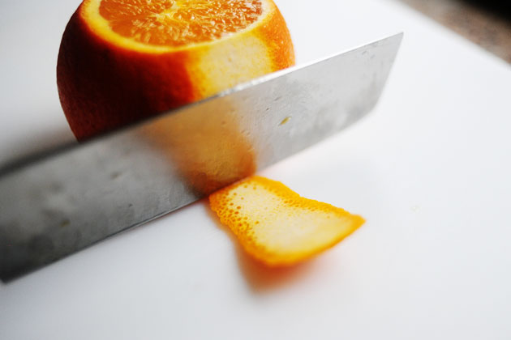

# Turkey Brine

## Ingredients
* 3 cups Apple Juice Or Apple Cider
* 2 gallons Cold Water
* 4 Tablespoons Fresh Rosemary Leaves
* 5 cloves Garlic, Minced
* 1½ cup Kosher Salt
* 2 cups Brown Sugar
* 3 Tablespoons Peppercorns
* 5 whole Bay Leaves 
* Peel Of Three Large Oranges (See image, try not to get too much of the white of the peel)

## Directions
Combine all ingredients in a large pot. Stir until salt and sugar dissolve. Bring to a boil, then turn off heat and cover.

Allow to cool completely, then pour into a large brining bag or pot. Place uncooked turkey in brine solution, then refrigerate for 16 to 24 hours. 

When ready to roast turkey, remove turkey from brine. Submerge turkey in a pot or sink of fresh, cold water. Allow to sit in clean water for 15 minutes to remove excess salt from the outside. 

Discard brine. Remove turkey from clean water, pat dry, and cook according to your normal roasting method. 

#recipes #sides