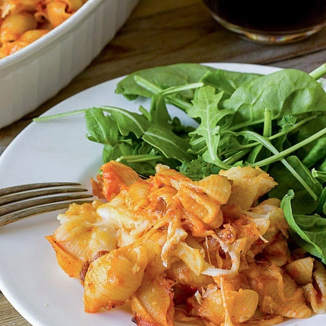

# Vodka Pasta Bake
_Serves 6 - 8_

## Ingredients
* 1 (16 ounce) package pasta shells, or similar shape
* 4 ounces pancetta
* 3 hot Italian sausage links, removed from casing
* 3 cups good-quality vodka sauce, I prefer Rao’s
* 1 (8 ounce) ball fresh mozzarella, chopped or pulled into bite-size pieces
* 1 lb baby spinach
* 2 cups shredded mozzarella cheese, divided
* ½ cup freshly grated Parmesan cheese
* Kosher salt and freshly ground black pepper, to taste

## Directions
Preheat oven to 350°F. Grease a large baking or casserole dish.

Bring a large pot of generously salted water to a boil and cook shells until very al dente. Strain, reserving a cup of pasta water, and return the noodles to the pot.

Meanwhile, sauté the pancetta and sausage in a skillet over medium-high heat until crisp and golden brown. Remove from pan and set aside. In the oil released from the pancetta and sausage add the spinach, cook until wilted.

Stir the pancetta, sausage, spinach, tomato sauce, fresh mozzarella, and 1 1/2 cups of the shredded mozzarella into the cooked noodles. Season with salt and pepper to taste. Pour into prepared baking dish and top with the remaining shredded mozzarella and Parmesan. Bake, uncovered, for 30 minutes, or until bubbling and light golden brown.

To reheat, cut the casserole into large squares. Pour about 1/4 to 1/2 cup of leftover pasta water into the seams and around the edges. (This allows moisture to steam the casserole instead of drying it out. The slices will “cook” themselves back together and the water will evaporate.)

Cover with aluminum foil and bake at 350°F until hot and bubbly.

#recipes #dinner